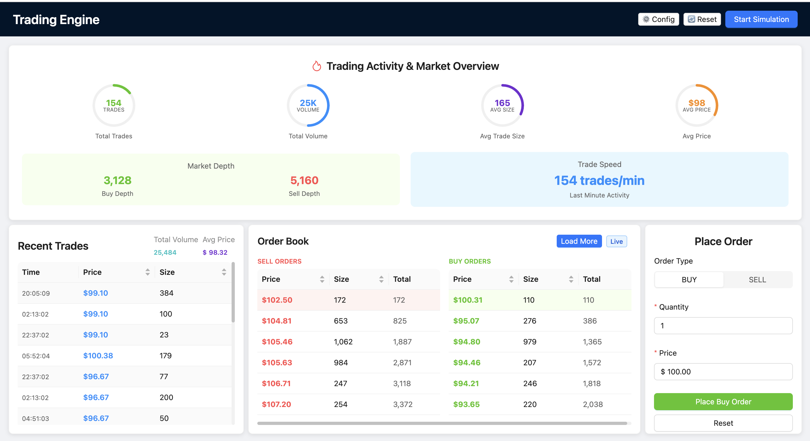

# Trading Engine - High-Performance Order Book System

<div align="center">



*A modern, high-performance trading engine with real-time order book visualization*

[](https://en.cppreference.com/w/cpp/17)
[](https://reactjs.org/)
[](https://www.typescriptlang.org/)
[](https://cmake.org/)

</div>

## 🚀 Overview

This is a **personal learning project** that implements a high-performance trading engine with a modern web-based frontend for real-time order book visualization and trading simulation. The system features a C++ backend optimized for speed and a React frontend with intuitive trading interfaces.

*This project is for educational and demonstration purposes only.*

### ✨ Key Features

- **High-Performance Order Book**: C++ implementation with optimized data structures
- **Real-Time WebSocket Communication**: Live updates between frontend and backend
- **Interactive Trading Interface**: Modern React-based UI with Ant Design components
- **Configurable Simulation**: Customizable order generation with various parameters
- **Market Visualization**: Real-time charts and statistics
- **RESTful API**: Complete HTTP API for order management
- **Cross-Platform**: Runs on macOS, Linux, and Windows
- **Educational Focus**: Designed for learning modern software development practices

## 📸 Project Demo

<div align="center">


*Complete trading engine interface showing real-time order book, trading activity, and simulation controls*

</div>

## 🏗️ Architecture

```
┌─────────────────┐    WebSocket/HTTP    ┌─────────────────┐
│  React Frontend │ ◄──────────────────► │   C++ Backend   │
│                 │                      │                 │
│ • Order Book UI │                      │ • Order Book    │
│ • Trade History │                      │ • HTTP Server   │
│ • Order Form    │                      │ • WebSocket     │
│ • Simulation    │                      │ • JSON Utils    │
└─────────────────┘                      └─────────────────┘
```

### Backend Components

- **Order Book Engine**: High-performance order matching and management
- **HTTP Server**: RESTful API for order operations
- **WebSocket Server**: Real-time data streaming
- **JSON Utilities**: Lightweight JSON parsing and serialization
- **Trading API**: Order processing and market data endpoints

### Frontend Components

- **Trading Dashboard**: Real-time market overview with circular progress indicators
- **Order Book Table**: Side-by-side buy/sell order display
- **Order Form**: Interactive order submission with validation
- **Trade History**: Recent trade tracking with statistics
- **Simulation Panel**: Configurable order generation system

## 🛠️ Technology Stack

### Backend
- **C++17**: Core trading engine implementation
- **CMake**: Build system with optimization flags
- **Custom HTTP Server**: Lightweight HTTP implementation
- **WebSocket**: Real-time communication protocol
- **OpenSSL**: Secure WebSocket connections

### Frontend
- **React 18**: Modern UI framework
- **TypeScript**: Type-safe development
- **Ant Design**: Professional UI components
- **Vite**: Fast development and build tool
- **WebSocket API**: Real-time data updates

## 🚀 Quick Start

### Prerequisites

- **C++17 Compiler** (GCC 7+, Clang 5+, or MSVC 2017+)
- **CMake 3.20+**
- **Node.js 16+** and **npm**
- **OpenSSL** (for WebSocket support)

### Installation

1. **Clone the repository**
   ```bash
   git clone https://github.com/WeiXia-0000/Trading-Engine.git
   cd Trading-Engine
   ```

2. **Build the backend**
   ```bash
   cd backend
   mkdir build && cd build
   cmake -DCMAKE_BUILD_TYPE=Release ..
   make -j$(nproc)
   ```

3. **Install frontend dependencies**
   ```bash
   cd ../../frontend
   npm install
   ```

### Running the Application

1. **Start the backend server**
   ```bash
   cd backend/build
   ./trading_engine
   ```
   The server will start on `http://localhost:8080`

2. **Start the frontend development server**
   ```bash
   cd frontend
   npm run dev
   ```
   The frontend will be available at `http://localhost:3000`

3. **Access the application**
   Open your browser and navigate to `http://localhost:3000`

## 📊 Performance Features

### Backend Optimizations
- **Link-Time Optimization (LTO)**: Maximum performance compilation
- **Native Architecture**: `-march=native` for CPU-specific optimizations
- **Aggressive Optimization**: `-O3` with `-DNDEBUG` for release builds
- **Thread-Safe Operations**: Mutex-protected order book access
- **Memory-Efficient Data Structures**: Optimized for high-frequency trading

### Frontend Optimizations
- **Real-Time Updates**: WebSocket-based live data streaming
- **Efficient Rendering**: React optimization with proper state management
- **Responsive Design**: Single-window layout with no scrolling
- **Configurable Simulation**: Adjustable parameters for realistic testing

## 🔧 Configuration

### Simulation Parameters

The trading simulation can be configured through the web interface:

- **Generation Speed**: 0.5s - 10s intervals
- **Order Size Distribution**: Small vs large order probability
- **Price Range**: Base price and variation settings
- **Order Types**: Configurable buy/sell ratios

### API Endpoints

- `GET /api/orderbook` - Get current order book
- `GET /api/trades` - Get recent trade history
- `POST /api/orders` - Submit new order
- `GET /api/market-summary` - Get market statistics
- `GET /api/health` - Health check endpoint

## 🧪 Testing

### Backend Testing
```bash
cd backend/build
./benchmark
```

### Frontend Testing
```bash
cd frontend
npm run test
```

## 📚 Learning Objectives

This project demonstrates:

- **C++ Performance Optimization**: Link-time optimization, native architecture targeting
- **Modern React Development**: Hooks, TypeScript, component architecture
- **Real-Time Communication**: WebSocket implementation and HTTP API design
- **System Architecture**: Microservices communication patterns
- **Build Systems**: CMake configuration and optimization
- **UI/UX Design**: Professional trading interface development

## 📈 Benchmark Results

The system is designed for high-performance trading scenarios:

- **Order Processing**: Sub-millisecond order matching
- **Memory Usage**: Optimized for minimal memory footprint
- **Concurrent Access**: Thread-safe operations for multiple clients
- **Real-Time Updates**: Low-latency WebSocket communication


## 👨‍💻 Author

**Wei Xia**
- GitHub: [@WeiXia-0000](https://github.com/WeiXia-0000)

## 🙏 Acknowledgments

- Built with modern C++ and React best practices
- Inspired by real-world trading system architectures
- Uses industry-standard optimization techniques
- **Note**: This is a personal learning project for educational purposes

---

<div align="center">

**⭐ Star this repository if you found it helpful for learning!**

*This is a personal learning project - feel free to explore the code and learn from the implementation.*

</div>